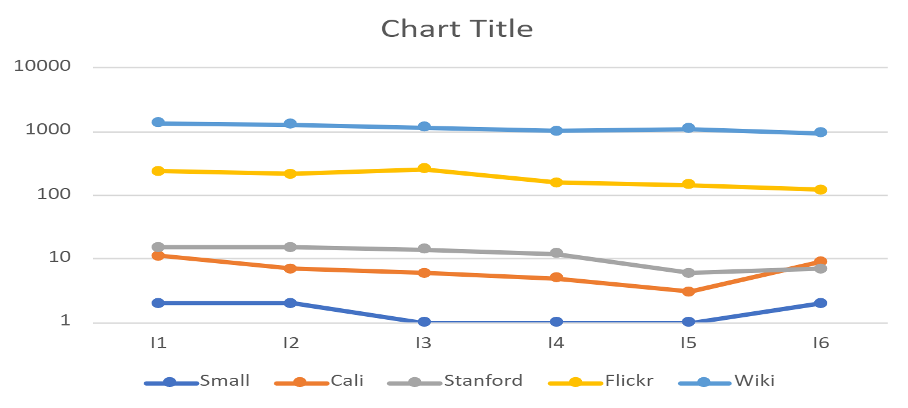

# PROJECT REPORT- DAVIDE MAFFI, GIANMARCO LODARI

## Building the code

* `make`: it will create a `bin` folder and a `b` executable inside it.
* You need `nvcc` and `cuBLAS` to be available.
* Make sure to update the `Makefile` to match your GPU architecture (open the file for more information)
* This has been tested on Linux and on Windows 11 using [WSL2](https://docs.nvidia.com/cuda/wsl-user-guide/index.html)

## Run the code

```
bin/b -d -c -n 1000 -b vec -I 1 -i 30 -t 32 -B 64
```

**Warning:** If running on Kepler GPUs (E.g. Nvidia K80), change branch with `git checkout kepler` to run code compatible with this GPU. The only difference is that the VectorSym example uses single-precision floating-point arithmetic, as `atomicAdd` on double-precision was not available in this architecture. Be aware of numerical issues when using large inputs and single-precision arithmetic! 

**Options**
* `-n`: size of the benchmark, e.g. number of elements in a vector or number of rows/colums in a square matrix. **Unused for Personalized PageRank**
* `-i`: number of repetitions of the test (30 by default)
* `-b`: name of the benchmark (`vec`, `mmul`, `ppr`)
* `-d`: if true, print debug results. Else, print a CSV-like format. If you change the code, make sure that nothing but the CSV is printed when `-d` is not present.
* `-c`: if true, validate the correctness of the output. It might take a while on large inputs!
* `-I`: implementation to use for a given benchmark. For example, `vec` has 3 different implementations (0, 1, 2). **Our ppr has 2**
* `-s`: warm-up iterations to skip when computing the average execution time (3 by default).
* `-v`: if using `nvprof`, using `-v` ensures that the profiler captures only the GPU computation and not the benchmark initialization or CPU validation, making profiling simpler. 

**Additional options for Personalized PageRank**
* `-g`: path to the MTX file of the input graph (`California` by default)
* `-a`: value of alpha (damping factor), from 0 to 1 (0.85 by default)
* `-m`: maximum number of iterations done in PPR (30 by default)
* `-e`: convergence threshold that must be met to stop the computation before the maximum number of iterations has been reached (`1e-6` by default)


## Contest: creating the Personalized PageRank benchmark

If you want to implement the Personalized PageRank benchmark, you need to implement the missing function in the PageRank class. 
The graph loading is already there for you, but you need to to the following:
1. `alloc`: allocate GPU memory or additional CPU memory.
2. `init`: initialize the PageRank computation (e.g. starting values of the PPR vector).
3. `reset`: reset the result and transfer data to the GPU.
4. `execute`: if you want to have multiple implementations, follow the pattern used in the other benchmarks. 
Otherwise, here you need to have the GPU host code responsible of starting and synchronizing the computation, and transferring the output from the GPU to the CPU.
5. `cpu_validation`: it computes the PPR computation on the CPU. GPU results must be moved to the `pr` array, so that they can be checked.
6. `print_result`: used for debugging, you can print the output in whatever format you prefer.
7. `clean`: deallocate GPU memory or additional CPU memory.


## Project organization
We decide to use the framework proposed by NVIDIA developer guide.

We firstly  analyze the cpu implementation and proceed to parallelize it mostly with atomicAdd
Then we proceed to optimize the gpu kernels, and then verify the results and decide how to proceed 

## Trivial optimizations
First working implementation: Initial time 43ms

Initial optimizations:
Copy back pr at end instead of each iteration -4ms  
Initial thread assignment (64 for Vertex-related loops, 512 for edges related loops) -8 ms
Remove unnecessary memsets (just useless memsets) -6ms
Pointer swap instead of memcpy (for pr and pr_temp swap)-4ms
Parallel reduction on euclidean (not really that necessary) -3ms

-25 ms so far for trivial optimizations

## Non-trivial optimizations

Following optimizations:
Pipeline memcpy (don't let current loop kernels wait for memcpy completion)-6ms
Stream initial implementation (each loop iteration proceeds on its own) -3ms
Stream final (error check pipeline, each error is checked while the following loop is already started, tradeoff with sync overhead) -5ms
Set memory in kernels (instead of using memset we assign value with loop in kernels) -3ms

-33ms so far for non-trivial optimizations


## Profiling
Now we decide to proceed to profiling, and we notice that for smaller datasets the speedup is <1 for GPU w.r.t. CPU

### First profiling 
On California dataset, setup with 100 iterations, nvprof shows that speedup w.r.t. first version is pretty good, and we notice the current bottlenecks are spmv coo and dot product. We decide to do a profilation on a bigger dataset and for a longer time


### Second profiling
After verifying the effectiveness of the first optimization, we proceed on the Wiki dataset, and nvprof shows that speedup is significant for large datasets, and that dot_product_gpu is not working well as we tought, so we proceed to reduce it

Before dot product optimization


After dot product optimization


### Third Profiling
We expected spmv coo to be the remaining bottleneck, so we proceed for another reduction, improving spmv by a little


### Profilings conclusions
After noticing that the only remaining bottleneck was the locking memcpy (loop is done in the cpu), we decide to aggregate the kernels as much as possible, and to use a main kernel doing the loop in the gpu and calling all the subkernels. This increases the speedup on large datasets such as wiki of 20% w.r.t. to CPU. At last we decided to try cublas libraries instead of our functions, to compare them.


## Cublas

We notice that the libraries function are not well suited for our purposes, but we try to adapt them anyway. 

* cublasDcopy: Typical utility function
* cublasDaxpy: Computes the sum of a double precision real vector scaled by a double precision real scalar and another double precision real vector, used instead of axbp_custom
* cublasDNrm2: Used in conjunction with various utilities to compute the euclidean distance
* cublasDDot: Typical dot product between vectors

Not being well tailored for our context, the small tweaks that we have to do to adapt them cause a non-negligible overhead, making our library implementation slower than our custom implementation (especially for initialization)

## Results

We decided to add two more datasets to see the speedup relative to the cpu  (Last generation Intel core i7)

We noticed that the speedup increases as exponentially w.r.t. the size of the dataset.

The following values are roundings in milliseconds of the execution times of the implementation at a given time (Rows) on a certain dataset(Columns)

| X          | 08/06 | 12/06 | 13/06 | 13/06 | 14/06 | 16/06 |
|------------|-------|-------|-------|-------|-------|-------|
| small      | 2     | 2     | 1     | 1     | 1     | 2     |
| Stanford   | 15    | 15    | 14    | 12    | 6     | 9     |
| California | 11    | 7     | 6     | 6     | 3     | 7     |
| Flickr     | 241   | 216   | 158   | 156   | 145   | 141   |
| Wiki       | 1348  | 1311  | 1157  | 1030  | 1117  | 1087  |

Stanford is a directed graph, based on highways and roads, while Flickr is an index of the website, they are 10k and 100k in size.

I1, I2, ecc. Refers to the rows of the previous table i.e. I1 is 08/06 codebase, I2 is 12/06 ecc.
Here is a visualization :



Running the code with -I 1 will run the cuBlas implementation, which is far slower than our custom, but we kept it for confrontation reasons
