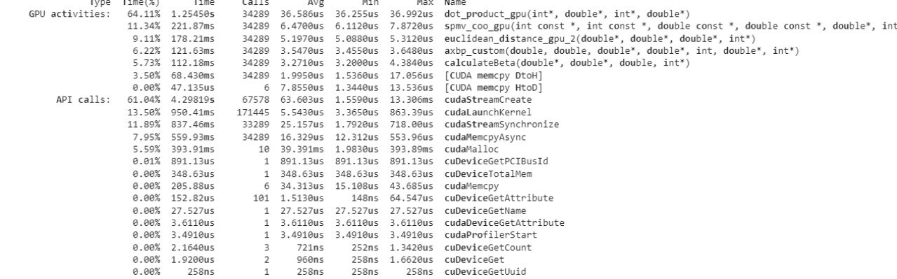
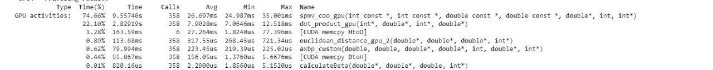
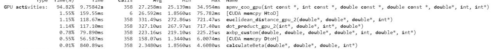
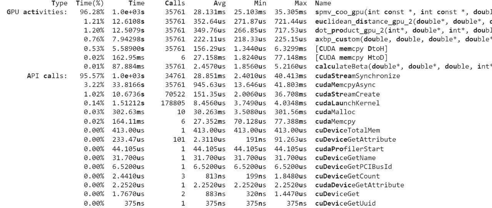

# PROJECT REPORT- DAVIDE MAFFI, GIANMARCO LODARI

## Project organization
We decide to use the framework proposed by NVIDIA developer guide.

We firstly  analyze the cpu implementation and proceed to parallelize it mostly with atomicAdd
Then we proceed to optimize the gpu kernels, and then verify the results and decide how to proceed 

## Trivial optimizations
First working implementation: Initial time 43ms

Initial optimizations:
Copy back pr at end instead of each iteration -4ms  
Initial thread assignment (64 for Vertex-related loops, 512 for edges related loops) -8 ms
Remove unnecessary memsets (just useless memsets) -6ms
Pointer swap instead of memcpy (for pr and pr_temp swap)-4ms
Parallel reduction on euclidean (not really that necessary) -3ms

-25 ms so far for trivial optimizations

## Non-trivial optimizations

Following optimizations:
Pipeline memcpy (don't let current loop kernels wait for memcpy completion)-6ms
Stream initial implementation (each loop iteration proceeds on its own) -3ms
Stream final (error check pipeline, each error is checked while the following loop is already started, tradeoff with sync overhead) -5ms
Set memory in kernels (instead of using memset we assign value with loop in kernels) -3ms

-33ms so far for non-trivial optimizations

## Profiling
Now we decide to proceed to profiling, and we notice that for smaller datasets the speedup is <1 for GPU w.r.t. CPU

### First profiling 
On California dataset, setup with 100 iterations, nvprof shows that speedup w.r.t. first version is pretty good, and we notice the current bottlenecks are spmv coo and dot product. We decide to do a profilation on a bigger dataset and for a longer time

### Second profiling
After verifying the effectiveness of the first optimization, we proceed on the Wiki dataset, and nvprof shows that speedup is significant for large datasets, and that dot_product_gpu is not working well as we tought, so we proceed to reduce it

Before dot product optimization

After dot product optimization

### Third Profiling
We expected spmv coo to be the remaining bottleneck, so we proceed for another reduction, improving spmv by a little

### Profilings conclusions
After noticing that the only remaining bottleneck was the locking memcpy (loop is done in the cpu), we decide to aggregate the kernels as much as possible, and to use a main kernel doing the loop in the gpu and calling all the subkernels. This increases the speedup on large datasets such as wiki of 20% w.r.t. to CPU. At last we decided to try cublas libraries instead of our functions, to compare them.

## Cublas

We notice that the libraries function are not well suited for our purposes, but we try to adapt them anyway. 

* cublasDcopy: Typical utility function
* cublasDaxpy: Computes the sum of a double precision real vector scaled by a double precision real scalar and another double precision real vector, used instead of axbp_custom
* cublasDNrm2: Used in conjunction with various utilities to compute the euclidean distance
* cublasDDot: Typical dot product between vectors

Not being well tailored for our context, the small tweaks that we have to do to adapt them cause a non-negligible overhead, making our library implementation slower than our custom implementation (especially for initialization)

## Results

We decided to add two more datasets to see the speedup relative to the cpu  (Last generation Intel core i7)

We noticed that the speedup increases as exponentially w.r.t. the size of the dataset.

The following values are roundings in milliseconds of the execution times of the implementation at a given time (Rows) on a certain dataset(Columns)

| X          | 08/06 | 12/06 | 13/06 | 13/06 | 14/06 | 16/06 |
|------------|-------|-------|-------|-------|-------|-------|
| small      | 2     | 2     | 1     | 1     | 1     | 2     |
| Stanford   | 15    | 15    | 14    | 12    | 6     | 9     |
| California | 11    | 7     | 6     | 6     | 3     | 7     |
| Flickr     | 241   | 216   | 158   | 156   | 145   | 141   |
| Wiki       | 1348  | 1311  | 1157  | 1030  | 1117  | 1087  |

Stanford is a directed graph, based on highways and roads, while Flickr is an index of the website, they are 10k and 100k in size.

Here is a visualization :

